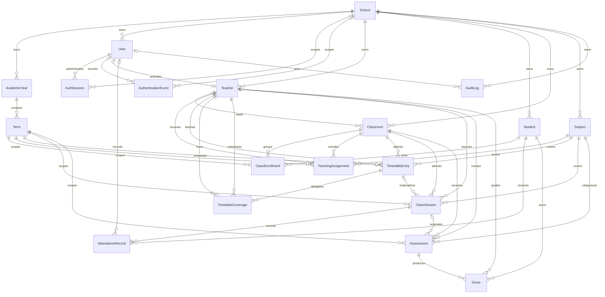
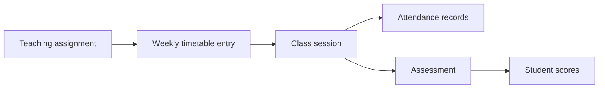
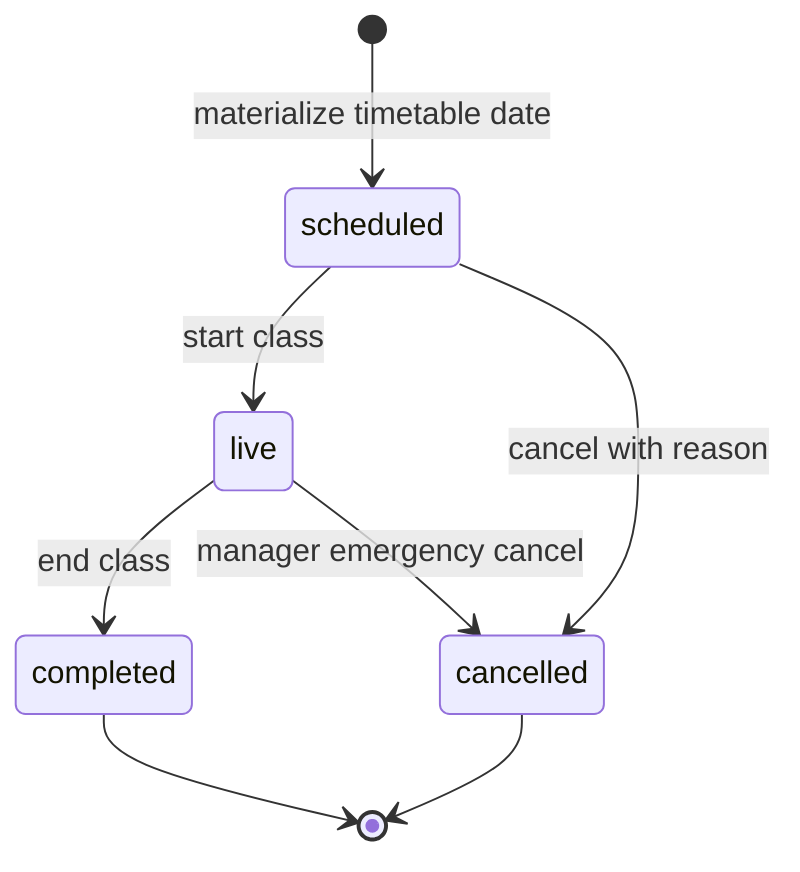

# Classroom OS Data Model

The Sprint 2 schema establishes the PostgreSQL foundation for teacher-led classroom operations. `School` is the tenant root, while a class session is the operational center for attendance and in-class assessment work.

## Entity responsibilities

| Entity | Responsibility |
| --- | --- |
| `School` | Tenant identity, timezone, and root ownership of all school data. |
| `AcademicYear` | School-specific academic calendar boundary containing terms. |
| `Term` | Scheduling, enrollment, teaching, session, and assessment period. |
| `User` | School identity with globally normalized email, Argon2id password hash, role, account status, and last-login time. |
| `AuthSession` | Revocable server-side login session storing only an opaque token hash, expiry, activity, and revocation time. |
| `AuthenticationEvent` | Minimal success/failure/logout security record with optional tenant/user and a one-way principal hash. |
| `Teacher` | Staff profile used by assignments, schedules, sessions, assessments, and grading. A profile may optionally link to a `User`. |
| `Student` | School-owned learner profile identified by a tenant-scoped student number. |
| `Classroom` | Stable class or homeroom grouping with an optional homeroom teacher. |
| `Subject` | School-owned subject catalog entry. |
| `ClassEnrollment` | Places a student in a classroom for one term. |
| `TeachingAssignment` | Authorizes or describes a teacher–classroom–subject combination for a term. |
| `TimetableEntry` | Recurring weekly schedule template with weekday, time range, room, teacher, classroom, and subject. |
| `TimetableCoverage` | Dated cover/swap approval that grants temporary access without changing original class ownership. |
| `ClassSession` | Dated occurrence of teaching work. It can be generated from a timetable entry or created ad hoc. |
| `AttendanceRecord` | One student's attendance outcome for one class session. |
| `Assessment` | Scored activity for a term, classroom, subject, and teacher; optionally created in a class session. |
| `Score` | One student's result for one assessment. |
| `AuditLog` | Immutable tenant-scoped record of a service mutation, optional actor, target entity, safe metadata, and timestamp. |

## Major relationships

## Tenant boundaries

`School.id` is the tenant key. All operational entities carry `schoolId`, even when the school could be reached through another relationship. This denormalized tenant key provides predictable query scoping and tenant-first indexes for common request paths.

Service-layer rules are mandatory:

1. Resolve the active school from trusted authorization context.
2. Add `schoolId` to every tenant-owned query and mutation filter.
3. Verify referenced IDs belong to that same school before writing relationships.
4. Group multi-record changes in a transaction.
5. Return not-found behavior rather than revealing that a cross-tenant record exists.

The initial Prisma schema uses direct foreign keys plus tenant-scoped unique constraints. It does not yet enable PostgreSQL row-level security or composite tenant foreign keys. Those controls should be evaluated before production data is onboarded.

### Runtime tenant enforcement

Database repositories require `schoolId` as an explicit argument. They never expose unscoped list, find, update, or delete operations. Scoped lookups deliberately return the same `TenantRecordNotFoundError` for missing and cross-tenant IDs so callers cannot probe another school's records.

Creating a session from a timetable entry runs in a transaction. The repository finds the timetable entry within the requested school, verifies its term, teacher, classroom, and subject belong to that school, then copies those authoritative IDs into the session. Arbitrary relationship reassignment is not exposed.

These helpers reduce accidental leakage but do not replace authorization, composite tenant foreign keys, or future PostgreSQL row-level security.

Application services are the supported business boundary. Each method requires `schoolId`, validates input before persistence, uses scoped repositories, and maps expected errors to stable transport-neutral codes. Cross-tenant and missing lookups use non-disclosing behavior. Authentication resolves a server-side session into trusted tenant and actor context; routes must replace, not merge from, any request-body scope.

## Authentication lifecycle and authorization

1. Login normalizes the email and verifies the stored hash with Argon2id. Unknown accounts still execute a dummy password verification to reduce timing disclosure.
2. Active credentials create a random 256-bit token. The browser receives it in an HttpOnly cookie, while PostgreSQL stores only its SHA-256 hash and expiry.
3. Each protected server render/action hashes the cookie, loads an unrevoked, unexpired session, and checks `User.status`, `School.isActive`, and the linked teacher status.
4. Logout revokes the session row. Successful login, failed login, and logout append sanitized `AuthenticationEvent` rows.
5. `SCHOOL_OWNER` and `ADMIN` may operate across academic resources within their own school. A `TEACHER` must have a matching `TeachingAssignment` for the exact term, classroom, and subject. The same subject in a different classroom remains a distinct authorization boundary.

Email is globally unique in the current staff-account model so email/password login is deterministic. Each user belongs to exactly one school. A future cross-school identity design would require an explicit organization selector or separate identity/account tables.

## Operational lifecycle

1. A `TeachingAssignment` establishes who teaches a subject to a classroom during a term.
2. A `TimetableEntry` captures the recurring weekday, start/end time, room, teacher, class, and subject. Separate uniqueness constraints prevent a teacher or classroom from being double-booked at the same start time.
3. An optional `TimetableCoverage` request delegates one local date. It remains `pending` until the substitute (or a manager) accepts it. Cover and swap acceptance checks timetable conflicts; cancellation/decline does not grant access. The original timetable and teaching assignment are never reassigned.
4. The application materializes a dated `ClassSession`. The session stores the original teacher, classroom, subject, and scheduled timestamps as an operational snapshot and may reference the originating timetable entry. Ad hoc sessions leave that reference empty.
5. The current term's `ClassEnrollment` rows determine the expected roster. Each student can have at most one attendance record per session.
6. An `Assessment` may reference the session where it was created. Each student can have at most one score per assessment; missing remains distinct from zero.
7. Every successful service mutation appends a sanitized `AuditLog` in the same database transaction.

## Service-enforced rules

- Only `scheduled` sessions transition to `live`; only `live` sessions transition to `completed`.
- Normal attendance and linked assessment score entry stops after completion or cancellation. Owner/admin correction is a separate completed-session command that preserves immutable before/after history.
- Attendance and scores are accepted only for active enrollment in the matching term and classroom.
- Score values must be between zero and the assessment maximum.
- Timetable intervals must use Monday-Friday, have increasing times, and must not overlap another active entry for the same teacher or classroom in the term.
- Batch inputs reject duplicate student IDs before persistence.

PostgreSQL uniqueness constraints remain the final authority for exact duplicates. Interval overlap and lifecycle rules are transactionally checked by services but are not yet protected by exclusion/check constraints against every possible concurrent writer.

## Enforced invariants

- UUID primary keys on every model.
- PostgreSQL-native `gen_random_uuid()` defaults for every primary key.
- Tenant-scoped student, employee, classroom, and subject identifiers; staff email is globally unique for deterministic login.
- At most one enrollment for a student in the same classroom and term.
- At most one attendance record for a student in a class session.
- At most one score for a student on an assessment.
- At most one scheduled occurrence for a classroom or teacher at the same term, weekday, and start time.
- Timestamps on all core entities, with automatic `updatedAt` maintenance.
- Tenant/entity/time indexes for audit history queries.
- PostgreSQL partial unique indexes allowing one `AcademicYear.isCurrent` and one `Term.isCurrent` row per school.

Rules such as `startTime < endTime`, valid weekday range, interval-overlap prevention, non-negative scores, and score values not exceeding an assessment's maximum are enforced by the application services. They may later be reinforced with reviewed PostgreSQL check constraints or exclusion constraints. The service must also maintain at most one current academic year and term per school, and normalize case for email and business-code uniqueness.

The current-period invariant is now also protected by the `enforce_current_academic_periods` migration. Service transactions unset the previous selection before setting a new current year or term, while partial unique indexes close the concurrent-writer gap. A current term always causes its parent academic year to become current; switching to another year clears a current term belonging to the former year.

Teaching-assignment administration intentionally treats `(termId, teacherId, classroomId, subjectId)` as the complete scope. A teacher can teach the same subject in multiple classrooms and can teach multiple subjects in one classroom. Admin screens display all four dimensions, so classroom A and classroom B are never visually or logically merged.

## Timetable and Live Class lifecycle

`TimetableEntry.teachingAssignmentId` is required and must match its denormalized term, teacher, classroom, and subject. Materialization copies that assignment and all four dimensions to `ClassSession`; the classroom context is therefore immutable through the live lifecycle. The same subject in classrooms A and B produces separate timetable rows, session rows, rosters, attendance records, and timelines.

Only `scheduled` may start and only `live` may end. Repeated materialize/start/end calls return the existing intended state where safe. A PostgreSQL partial unique index permits at most one `live` session per teacher, including concurrent requests. Completed and cancelled sessions never reopen. Attendance roster reads and writes join active `ClassEnrollment` by the session's exact term and classroom; student IDs from another classroom are rejected even when the teacher teaches both classrooms.

Timeline events (`SESSION_STARTED`, `ATTENDANCE_UPDATED`, `ATTENDANCE_CORRECTED`, `SESSION_ENDED`, `SESSION_CANCELLED`) belong to one school and one class session and are indexed by session/time. Timeline metadata is deliberately limited to safe identifiers, occurrence times, state changes, and attendance counts. Audit logs separately capture the actor, action, entity, and safe mutation metadata for operational accountability.

`AttendanceCorrection` links one school, attendance record, class session, student, and optional actor. It stores before/after status and note plus the required human reason and timestamp. Corrections never rewrite or delete earlier correction/audit rows. Optimistic `AttendanceRecord.updatedAt` comparison rejects stale manager actions. `ClassSession.cancelledAt`, `cancelledById`, and `cancellationReason` capture the terminal cancellation fact; no reverse transition exists.

Attendance reporting excludes cancelled and future scheduled sessions from its denominator. Live, completed, and past scheduled (missed) sessions count toward expected attendance; unrecorded enrolled students become `unrecorded`. Percentage is `(present + late) / (present + late + absent + leave + unrecorded) × 100`. School-wide display is explicitly labeled and aggregates remain keyed by classroom and subject.

## Runtime verification

Vitest integration tests run against the disposable local PostgreSQL database. They create unique synthetic tenants, verify tenant-scoped repositories and database uniqueness constraints, and remove their own records in dependency order. A safety guard refuses non-local hosts and database names other than `classroom_os`.

## Explicitly excluded

This foundation has no biometric or face-recognition tables, no real student data, and no parent/student application models. Social login, password reset, MFA, and production identity-provider configuration remain out of scope.

Profile and onboarding additions include nullable contact fields on `User`/`School`, `EmailChangeRequest`, and `PendingSchoolRegistration`. Pending rows are pre-tenant and may create only a new school plus its first owner after a one-time verification token is consumed. Email-change rows are tenant- and user-bound; confirmation changes the email, revokes sessions, and writes a sanitized audit record atomically.
