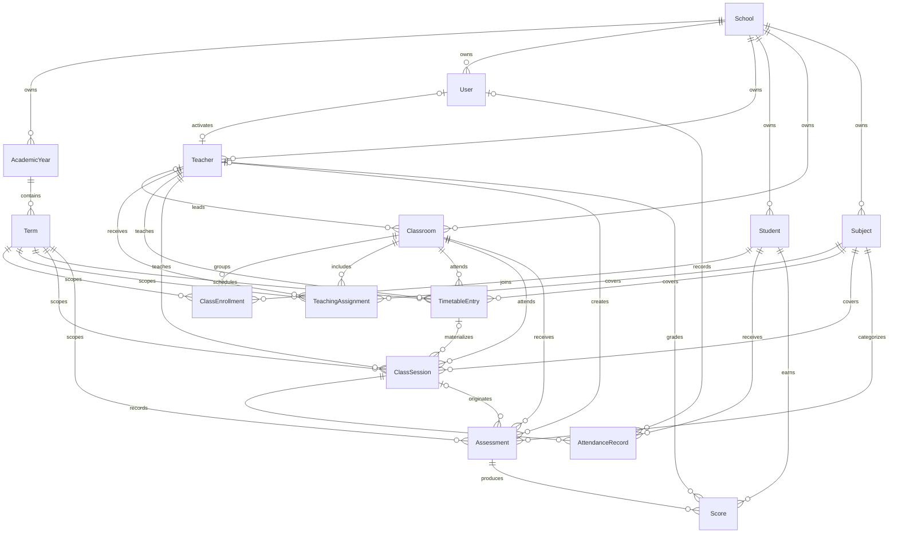
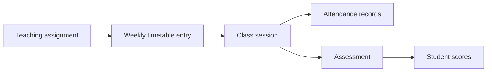

# Classroom OS Data Model

The Sprint 2 schema establishes the PostgreSQL foundation for teacher-led classroom operations. `School` is the tenant root, while a class session is the operational center for attendance and in-class assessment work.

## Entity responsibilities

| Entity | Responsibility |
| --- | --- |
| `School` | Tenant identity, timezone, and root ownership of all school data. |
| `AcademicYear` | School-specific academic calendar boundary containing terms. |
| `Term` | Scheduling, enrollment, teaching, session, and assessment period. |
| `User` | Future sign-in/RBAC identity for a school administrator or teacher. No authentication logic is included yet. |
| `Teacher` | Staff profile used by assignments, schedules, sessions, assessments, and grading. A profile may optionally link to a `User`. |
| `Student` | School-owned learner profile identified by a tenant-scoped student number. |
| `Classroom` | Stable class or homeroom grouping with an optional homeroom teacher. |
| `Subject` | School-owned subject catalog entry. |
| `ClassEnrollment` | Places a student in a classroom for one term. |
| `TeachingAssignment` | Authorizes or describes a teacher–classroom–subject combination for a term. |
| `TimetableEntry` | Recurring weekly schedule template with weekday, time range, room, teacher, classroom, and subject. |
| `ClassSession` | Dated occurrence of teaching work. It can be generated from a timetable entry or created ad hoc. |
| `AttendanceRecord` | One student's attendance outcome for one class session. |
| `Assessment` | Scored activity for a term, classroom, subject, and teacher; optionally created in a class session. |
| `Score` | One student's result for one assessment. |

## Major relationships

## Tenant boundaries

`School.id` is the tenant key. All operational entities carry `schoolId`, even when the school could be reached through another relationship. This denormalized tenant key provides predictable query scoping and tenant-first indexes for common request paths.

Service-layer rules are mandatory:

1. Resolve the active school from trusted authorization context.
2. Add `schoolId` to every tenant-owned query and mutation filter.
3. Verify referenced IDs belong to that same school before writing relationships.
4. Group multi-record changes in a transaction.
5. Return not-found behavior rather than revealing that a cross-tenant record exists.

The initial Prisma schema uses direct foreign keys plus tenant-scoped unique constraints. It does not yet enable PostgreSQL row-level security or composite tenant foreign keys. Those controls should be evaluated before production data is onboarded.

### Runtime tenant enforcement

Database repositories require `schoolId` as an explicit argument. They never expose unscoped list, find, update, or delete operations. Scoped lookups deliberately return the same `TenantRecordNotFoundError` for missing and cross-tenant IDs so callers cannot probe another school's records.

Creating a session from a timetable entry runs in a transaction. The repository finds the timetable entry within the requested school, verifies its term, teacher, classroom, and subject belong to that school, then copies those authoritative IDs into the session. Arbitrary relationship reassignment is not exposed.

These helpers reduce accidental leakage but do not replace authorization, composite tenant foreign keys, or future PostgreSQL row-level security.

## Operational lifecycle

1. A `TeachingAssignment` establishes who teaches a subject to a classroom during a term.
2. A `TimetableEntry` captures the recurring weekday, start/end time, room, teacher, class, and subject. Separate uniqueness constraints prevent a teacher or classroom from being double-booked at the same start time.
3. The application materializes a dated `ClassSession`. The session stores teacher, classroom, subject, and scheduled timestamps as an operational snapshot and may reference the originating timetable entry. Ad hoc sessions leave that reference empty.
4. The current term's `ClassEnrollment` rows determine the expected roster. Each student can have at most one attendance record per session.
5. An `Assessment` may reference the session where it was created. Each student can have at most one score per assessment.

## Enforced invariants

- UUID primary keys on every model.
- PostgreSQL-native `gen_random_uuid()` defaults for every primary key.
- Tenant-scoped student, employee, classroom, subject, and user identifiers.
- At most one enrollment for a student in the same classroom and term.
- At most one attendance record for a student in a class session.
- At most one score for a student on an assessment.
- At most one scheduled occurrence for a classroom or teacher at the same term, weekday, and start time.
- Timestamps on all core entities, with automatic `updatedAt` maintenance.

Rules such as `startTime < endTime`, valid weekday range, interval-overlap prevention, date ordering, non-negative scores, and score values not exceeding an assessment's maximum require service validation and may later be reinforced with reviewed PostgreSQL check constraints, exclusion constraints, or triggers in the first migration. The service must also maintain at most one current academic year and term per school, and normalize case for email and business-code uniqueness.

## Runtime verification

Vitest integration tests run against the disposable local PostgreSQL database. They create unique synthetic tenants, verify tenant-scoped repositories and database uniqueness constraints, and remove their own records in dependency order. A safety guard refuses non-local hosts and database names other than `classroom_os`.

## Explicitly excluded

This foundation has no biometric or face-recognition tables, no seed or real student data, and no parent/student application models. Authentication implementation and production connection configuration are separate future work.
