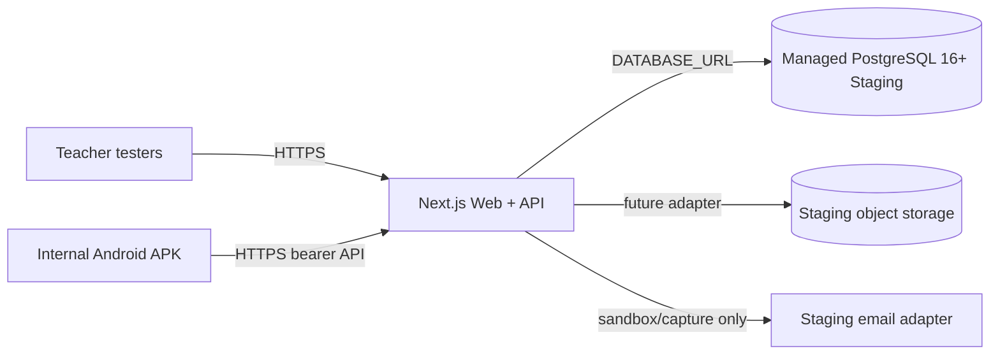

# Classroom OS Staging architecture

UAT-ENV-001 prepares a non-production environment for 3–5 synthetic teacher testers. It is not a production launch and it must never share a database, secrets, storage bucket, or cookies with development or production.

## Boundaries

- Web/API: Next.js deployment on a Next-compatible public host, preferably a Preview/Staging project rather than Production.
- Database: a separate managed PostgreSQL 16+ database. Run `prisma migrate deploy` before traffic; never run `migrate dev` or use the local Docker volume.
- Mobile: Expo EAS internal `preview` APK with `EXPO_PUBLIC_API_BASE_URL` supplied by the EAS environment. No localhost or LAN address is committed.
- Secrets: `DATABASE_URL`, password values, and provider credentials stay in the host/EAS secret store. Public `EXPO_PUBLIC_*` values are not secrets.
- Email: use a sandbox or mail-capture provider. Until one is configured, password-reset and verification delivery are not production-ready.
- Images: current profile upload writes to `apps/web/public/uploads`, which is local ephemeral storage. Staging should disable new uploads or show the initials fallback until object storage is selected.
- Data: only deterministic UAT records tagged by `UAT-CLASSROOM-OS` and synthetic names are allowed.

## Backup, reset, and teardown

Take a managed-provider snapshot before a reset. The guarded `db:reset:uat` operation deletes only the UAT school after requiring `CLASSROOM_OS_ENV=staging`, `UAT_SEED_CONFIRM=CLASSROOM-OS-UAT`, and a non-local PostgreSQL URL. Teardown is provider-specific: disable the Preview deployment, revoke tester sessions, remove the staging database, and remove provider secrets. Never remove the development named volume as part of UAT teardown.

Known limitations are documented in [staging-environment](staging-environment.md), [staging-email](staging-email.md), and [android-internal-build](android-internal-build.md).
